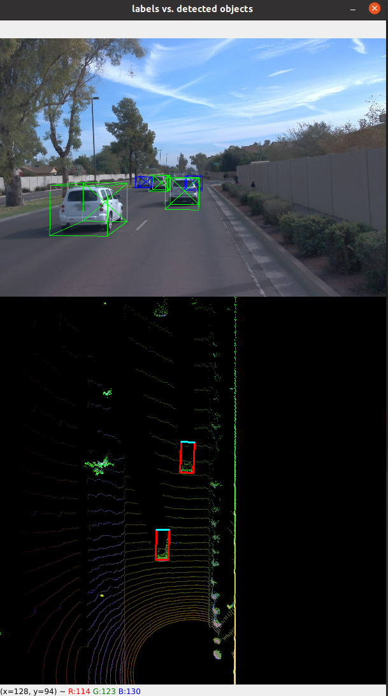

# Writeup: Midterm: 3D Object Detection

## Section 1 : Compute Lidar Point-Cloud from Range Image

### Visualize range image channels (ID_S1_EX1)

The Range Image in waymo open dataset is shown in the above image.
### Visualize lidar point-cloud (ID_S1_EX2)

In the image above, vehicle 1 is most visible and vehicle 10 is least visible.,  
Except for the images in the bottom line (vehicles 7 to 10), vehicles shows rectangular shape seen from above.  
Also inside these rectangles, the point-cloud heights tends to rise towards the center.  
These rectangular features and it's characteristics are the most stable and useful features if the point-cloud is seen from above.  

But if we look at the image below, the rectangular features mentioned above are only notable in the height map.  
In the intensity map, The rear-bumper is the most notable feature seen from BEV.

## Section 2 : Create Birds-Eye View from Lidar PCL

### Convert sensor coordinates to BEV-map coordinates (ID_S2_EX1)

### Compute intensity layer of the BEV map (ID_S2_EX2)

### Compute height layer of the BEV map (ID_S2_EX3)

## Section 3 : Model-based Object Detection in BEV Image

### Add a second model from a GitHub repo (ID_S3_EX1)

### Extract 3D bounding boxes from model response (ID_S3_EX2)

## Section 4 : Performance Evaluation for Object Detection

### Compute intersection-over-union between labels and detections (ID_S4_EX1)

### Compute precision and recall (ID_S4_EX3)

