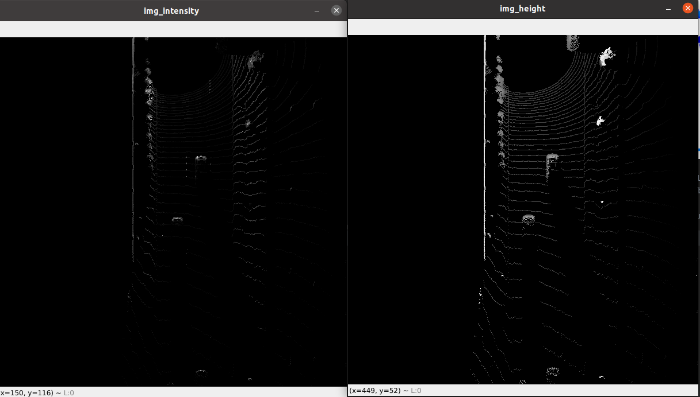

# Writeup: Midterm: 3D Object Detection

## 1. Ten examples of Vehicles with varying degrees of visibility in the point-cloud

In the image above, vehicle 1 is most visible and vehicle 10 is least visible.,  
Except for the images in the bottom line (vehicles 7 to 10), vehicles shows rectangular shape seen from above.  
Also inside these rectangles, the point-cloud heights tends to rise towards the center.  
These rectangular features and it's characteristics are the most stable and useful features if the point-cloud is seen from above.  

But if we look at the image below, the rectangular features mentioned above are only notable in the height map.  
In the intensity map, The rear-bumper is the most notable feature seen from BEV.

